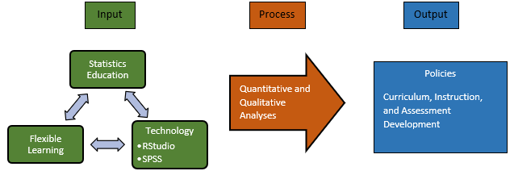
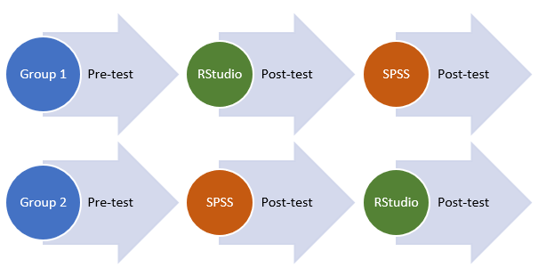

# INTRODUCTION

## The Problem and its Background

The effects of using R [@R] and RStudio [@RStudio] on pre-service teachers' coding and data management and on instructional materials design will be investigated in this paper.

"R is a language and environment for statistical computing and graphics" [@R]. It is open source and can be used in a wide array of statistical (linear and nonlinear modeling, classical statistical tests, time-series analysis, classification, clustering, etc.) and graphical techniques that can be extended with the use packages. Currently there are 16,732 packages available for various statistical computations and other tasks. According to the R Core Team; "one of R’s strengths is the ease with which well-designed publication-quality plots can be produced, including mathematical symbols and formulae where needed". R has recently gained popularity in universities and research institutes and is currently 8th in the August, 2020 TIOBE's index for programming language popularity from being 20th last year mainly due to its being open source and its use in the COVID 19 research and analytics [@whitney20]. Using R is a practical application of coding and it is an essential tool for data management. It is also a great tool for instructional materials design in mathematics subjects.

On the other hand, RStudio has made the use or R easy, manageable, and and even more extensible. "RStudio is an integrated development environment (IDE) for R" [@RStudio]. It is also open source. RStudio includes a console, syntax-highlighting editor for direct code execution, as well as tools for plotting, history, debugging and workspace management. Furthermore, RStudio has integrated support for version control systems like Git [@chacon20] that can lead to the use of GitHub [@github]; a website that host code repositories for collaboration. Recently, RStudio cloud [@rstudiocloud] was created to support the use of RStudio directly from the web browser without the hardware hassles. It is designed for instructors and students for the purpose of teaching and learning data science with RStudio. 

R and RStudio presents a very powerful and economical tool to teach and learn mathematics. It is a potential tool to teach Mathematics in the Modern World; the only mathematics subject taught in all courses being a general education subject. Mathematics in the Modern world is a subject that gives all college students the foundation for the application of mathematics in their daily lives [@MMW]. In the sample syllabus, learning outcomes are classified into three; knowledge, skills, and values. Under knowledge: 1) Discuss and argue about the nature of mathematics, what it is, how it is expressed, represented and used, 2) Use different types of reasoning to justify statements and arguments made about mathematics and mathematical concepts, 3) Discuss the language and symbols of mathematics. Under skills: 1) Use a variety of statistical tools to process and manage numerical data, 2) Analyze codes and coding schemes used for identification, privacy, and security purposes, 3) use mathematics in other areas such as finance, voting, health and medicine, business, environment, arts and design, and recreation. For values: 1) Appreciate the nature and uses of mathematics in everyday life, 2) Affirm honesty and integrity in the application of mathematics to various human endeavors. However, It is quite surprising that the popularity of R and RStudio among academicians in the province is very minimal.

Now, the entire world is under the devastation of COVID 19. We are in a public health emergency and everyone is concerned with public safety. Measures taken by the government have drastically changed the normal state of practice in all offices. In the education sector, face to face classroom set up is no longer being practiced. The Commission on Higher Education implemented flexible learning to cope up with this situation [@CMO_04_20]. However, instruction through flexible learning is very challenging. The Commission on Higher Education stated in the guidelines that "the main objective should be to provide learners with the most flexibility on the learning content, schedules, access, and innovative assessment, making use of digital and non-digital tools" (p. 3). Teachers need to be creative in able to device new ways to be effective in implementing flexible learning.

The teaching of data management can really be challenging in this situation; implementing flexible learning. Although Data Management is just a part of the general education subject Mathematics in the Modern World, it is very crucial to make the students' learning experience meaningful since data management is very useful in a world where data is really abundant. The use of software in this regard will introduce the student to powerful tools that will really help them give meaning to data that they encounter in their jobs and daily lives. To reiterate this, the text book used in  Mathematics in the Modern World at Nueva Vizcaya State University (NVSU) states that going through Data Management, students should be able to:

1. Use a variety of statistical tools to process and manage numerical data;

2. Use the methods of linear regression and correlation to predict the value of a variable given certain conditions; and

3. Advocate the use of statistical data in making important decisions [@reyes18, p. 83].

The next section will highlight the necessity of this study in a bigger context.

## Rationale

The practice of statistics is computational. Statistical computing software are mainly used to do statistical computing. With the emergence of data science as a field due to big data, machine learning and powerful computers that are no longer expensive all brought about by the 4th industrial revolution, it is very fitting to consider how statistics education should adapt to these changes and be relevant in the practice of statistics. In this regard, in 2005, @franklin07 put forth the Guidelines for Assessment and Instruction in Statistics Education (GAISE) Report recommending a framework for statistics education both in the k to 12 and college level. In 2016, the @GCR16 revisited the effectiveness of the framework and still found it effective. The framework is now the standard in statistics education in the United States and in many countries that adopted it [@zieffler18].

In the GAISE report, one noteworthy recommendation is "the use of technology to explore concepts and analyze data" [@GCR16, p. 3]. Studies have shown that the use of technology can really improve statistics education; equipping learners with relevant data skills and effective powerful tools in this era where data is very much abundant [@doi16; @chance06; @chance07; @harraway12; @CR17; @stander17].  However, when it comes to software used in doing statistical computing and teaching statistics, there is no single statistical computing tool that fits all statistical tasks [@mcnamara18]. Nonetheless, introductory statistics students should be taught a common statistical computing software such as SAS, SPSS, or R, enthusing them to continuously learn statistics technology since statistical tools are diverse and eventually evolve through time [@gould18a]. Moreover, @gould10, @horton15a, @horton15 and @hardin15 pointed out the importance of developing among students -- with the use of statistical computing software -- data management skills in introductory and second courses in statistics.

In our country, leading universities are addressing this issue and have already integrated the use of technology in their curriculum for statistics education. The University of the Philippines for example uses a number of software in its introductory statistics courses and statistics courses (e.g.. R with RStudio, Python, SAS, SPSS, Stata, MS Excel, QGIS, ArcGIS, Gephi, yEd Graph Editor, and more). Most of the software used are open source. 

In the province, some universities have acquired SPSS to teach statistics courses. On the other hand, some still use calculators to do and teach statistical computing. Unfortunately, both setup do not lessen the gap between statistics education and statistical practice. In reality, most institutions to which graduates from these universities get employed cannot afford SPSS. The use of SPSS requires a paid license. One can choose MS Excel as an alternative, however its functions are limited [@biehler13].

Faced with the pandemic brought about by COVID19, the use of software in teaching statistics has become even more challenging than ever here in the province. This can be attributed to the fact that not all students can afford a laptop or a desktop, poor internet connection to no internet connection, and pedagogical challenges as a consequence of the previous two.

In this context, in an attempt to improve statistics education and the practice of statistics in NVSU, to provide a powerful tool to teach and practice statistics to future statistics teachers in the province, and to provide an alternative way of teaching statistics during the implementation of flexible learning in times of pandemic, the researcher will introduce the use of R with RStudio to the BSEd Mathematics and BS Mathematics students in their Data Management class. Then the researcher will see if there is a significant change in their performance in the class. Finally, the researcher will identify themes and categories that will anchor the study to the bigger context of statistics education and thereby serve as departure points as basis for policies that will lead to curriculum, instruction and assessment development with respect to statistics education in NVSU specially with flexible learning.

## Statement of the Problem

To adapt to the changes in technology brought about by the 4th industrial revolution, to be abreast with the global community when it comes to statistics education, and to address the pedagogical challenges brought about by flexible learning in teaching statistics in times of pandemic, RStudio as a statistical computing tool in learning data management will be introduced to BSEd Mathematics and BS Mathematics students of NVSU. The researcher will then answer the following questions after gathering profile variables, employing a two group counterbalanced measures design, and letting the students share their stories and narratives in using R and SPSS through essay:

1. What are the profile variables of the respondents?

2. What are the pre-test scores of the respondents?

3. What are the first and second post-test scores of the respondents?

4. Is there significant difference in the pre-test scores among the respondents in both groups?

5. Is there significant difference in the first post-test scores among the respondents in both groups based on their pre-test scores?

6. Is there significant difference in the second post-test scores among the respondents in both groups based on their pre-test scores?

7. What are the categories and themes on the narratives of the participants in using R and SPSS?

## Hypotheses

Is there a significant difference in the pre-test scores among the respondents in both groups?

>H~0~: There is no significant difference in the pre-test scores among the respondents in both groups.

>H~a~: There is significant difference in the pre-test scores among the respondents in both groups.

Is there significant difference in the first post-test scores among the respondents in both groups based on their pre-test scores?

>H~0~: There is no significant difference in the first post-test scores among the respondents in both groups based on their pre-test scores.

>H~a~: There is significant difference in the first post-test scores among the respondents in both groups based on their pre-test scores.

Is there significant difference in the second post-test scores among the respondents in both groups based on their pre-test scores?

>H~0~: There is no significant difference in the second post-test scores among the respondents in both groups based on their pre-test scores.

>H~a~: There is significant difference in the second post-test scores among the respondents in both groups based on their pre-test scores.

## Significance of the Study

This study is significant to universities and administrators since it will enlighten them to invest in free software which is more economical yet even at par with other leading statistical software. This is also important to faculty members who teach statistics and do research since it gives them a glimpse of what is happening in statistics education and in practice. Lastly, this study is significant to students for them to be able to see the practicality and applicability of other statistical software like R using RStudio.

## Scope and Delimitation

The focus of the study is to see the effect of using RStudio to the performance of students in their Data Management class. The respondents will be the BSEd Mathematics and BS Mathematics students taking up Mathematics in the Modern World in the first semester of school year 2020-2021 at Nueva Vizcaya State University Bayombong Campus. The study will also identify themes and categories that will anchor the study to the bigger context of statistics education and thereby serve as departure points as basis for policies that will lead to curriculum, instruction and assessment development with respect to statistics education in NVSU specially with flexible learning.

## Conceptual and Analytical Framework

Using RStudio in teaching statistics with flexible learning, four concepts were identified.

1. Technology Pedagogy Content Knowledge (TPCK) [@mishra06]. According to Mishra and Koehler, the introduction of new technology reconstructs the dynamic equilibrium among technology, pedagogy, and content knowledge. Flexible learning has changed the face of using technology in education. In this situation, it is very critical and important that teachers should rethink their technology, pedagogy and content knowledge.

2. Guidelines for Assessment and Instruction in Statistics Education (GAISE) College Report 2016 [@GCR16]. The report enumerated six recommendations: 1) Teach statistical thinking. 2) Focus on conceptual understanding. 3) Integrate real data with a context and purpose. 4) Foster active learning. 5) Use technology to explore concepts and analyze data. 6) Use assessments to improve and evaluate student learning. It is with these recommendations that statistics education can be improved. However, it can be really challenging to adopt these recommendations with flexible learning.

3. Reproducibility. The use of RStudio actually promotes reproducibility since it is a tool designed for reproducible research [@gandrud20]. The use of RStudio will help teachers create reproducible documents and analysis that can be easily reproduced by students. Reproducibility will play a huge role in overcoming the pedagogical challenges posed by flexible learning in teaching statistics.

4. Bridging the gap between tools for learning and doing statistics [@mcnamara15]. This has been the challenge in statistics education through the years. And it can be even more challenging now with flexible learning. RStudio can help with this with its capabilities for reproducible research. RStudio is designed for statistics education and also for the practice of statistics.

Statistics education is currently under flexible learning. In this study, technology will be integrated to statistics education. Figure 1 shows the analytical framework of the study. The analytical framework is input process output. The interaction among statistics education, flexible learning, and technology will be the input. Then through quantitative and qualitative methods, policies on curriculum, instruction, and assessment development will be the output.

## Definition of Terms

- **statistics education** - refers to the curriculum, instruction, and assessment in the teaching and learning of statistics.

# REVIEW OF RELATED LITERATURE

This part focuses on the chosen literature which I think are most relevant in my study. After reviewing significant literature, there are two themes I have generated: a) the necessity of statistics education and its current landscape and b) R using RStudio in teaching statistics. These will be discussed in the following sections of the paper.

## The Necessity of Statistics Education and its Current Landscape

The book entitled *International Handbook of Research in Statistics Education* edited by @benzvi18 offers a wide array of topics concerning statistics which best fit in this section. The book has three main parts which are interrelated to each other: Part I: Statistics, Statistics Education, and Statistics Education Research; Part II: Major Contributions of Statistics Education Research; and Part III: Contemporary Issues and Emerging Directions.

An article entitled “What Is Statistics Education?” succinctly discusses the nature and necessity of statistics education to all level -- from secondary to tertiary up to graduate level. The authors defined statistics education this way:

>Statistics education is an interdisciplinary field that is focused on the teaching and learning of statistics. Evolving from the field of mathematics education, which supplied valuable theories of learning, models of conceptual development and change, and methods of qualitative research (e.g., teaching experiments, clinical interviews), statistics education has emerged as an independent area of inquiry and scholarship with its own journals, conferences, organizations, websites, and curriculum standards [@zieffler18]. 

Based from the definition of statistics education, it is said to be an evolving field from the field of mathematics wherein it is “interdisciplinary” that focused on both “the teaching and learning of statistics” and thereby “emerged as an independent area of inquiry and scholarship”.

Perhaps the next inquiry is, why is statistics education necessary in everyday life and specifically in the curricula as well as how its integration in the curricula will help students abreast with technological pedagogy and skills.

The discussion of the book article “What Is Statistics?” by @wild18 directs our attention to the nitty-gritty of statistics and how this field is important in our day to day life given the advent of technological advances that produce rich data. For example, the authors argue that “In today’s data-rich world, all educated people need to understand statistical ideas and conclusions, to enrich both their professional and personal lives”. Thus, with this context of today’s world where data is accessible everywhere from mass media especially social network such as Facebook, it can be said that “the widespread availability of interesting and complex data sets and increasingly easy access to user-friendly visualization and analysis software mean that anyone can play with data to ask and answer interesting questions”. Statistics is vigorously gaining importance and recognition in today’s society.

Other authors also recognize the necessity of statistics:

>“Statistics is a central tool in moving science, economics, politics, schools, and universities forward”. Quantitative information is omnipresent in media and in the everyday lives of citizens worldwide. Data are increasingly used to add credibility to advertisements, arguments, or personal and professional advice. Therefore, there is a growing public and policy consensus that being able to provide reliable and persuasive evidence-based arguments and critically evaluate data-based inferences are crucial skills that all citizens of the twenty-first century should have [@benzvi16].

In addition, “statistical methods are used in almost all knowledge areas and increasingly are used by businesses, governments, health practitioners, other professionals, and individuals to make better decisions” [@wild18]. This is true wherein based on my observations, most government and private agencies rely on statistical methods through surveys to make policies, laws and even programs that are geared towards communities and nation’s development.

In this case then, academic institutions also integrated statistics in the curricula thinking that “probably no academic subject is more useful to both working professionals and informed citizens on a daily basis than statistics” [@wild18].  On this note, we can say then the impending necessity of statistics in the educational system. For instance, the book article “International Perspectives on the Teaching and Learning of Statistics” posits:

>Being able to provide sound evidence-based arguments and critically evaluate data-based claims are important skills that all citizens should have. It is not surprising therefore that the study of statistics worldwide at all educational levels is gaining more attention. The study of statistics provides students with tools, ideas and dispositions to react intelligently to information in the world around them. Reflecting this need to improve students’ ability to think statistically, statistical literacy and reasoning are becoming part of the mainstream school and university curricula in many countries. As a consequence, statistics education is becoming a thriving field of research and curricular development [@benzvi16].

However, “the rapid development of data science… provides challenges for statistics educators in determining learning goals, and opportunities for statistics education researchers to explore what instructional methods can best achieve those goals” [@wild18].  Moreover, the said article also points out present challenges of statistics education especially to students:

>What are the areas where statistics may need to adapt to be relevant to data science? In addition to pedagogy and content, technology is a key realm. While the Guidelines for Assessment and Instruction in Statistics Education (GAISE) K-12 (2005) and College (2016) reports encouraged the use of technology (which, on a more positive note, is now widespread in most courses), hundreds of thousands of high school students still use calculators rather than computers for their analyses, limiting their ability to move beyond simple calculations or gain any sense of realistic workflows that they might encounter in the real world. But much worse, it also narrowly constricts their vision of what statistics is and can be and neglects the huge potential of the visual sense for gaining insights from data [@wild18]. 

Given these challenges of statistics education in terms of pedagogy and content, one factor to consider is technology: most students use calculator over computer in statistical analyses. Aside from this, statistics can be seen in both perspectives wherein “despite the increasing awareness of the importance of statistical literacy, statistics has been viewed by many students as difficult and unpleasant to learn” [@benzvi16]. On the other hand, “many university instructors find statistics and research methods courses equally frustrating and unrewarding to teach” (ibid.). Not only that, “in schools, mathematics teachers often view statistics as a marginal strand in the mathematics curriculum and therefore minimize or ignore its teaching” (ibid.). Hence, it is no wonder how one article describes the dilemma of learning and teaching statistics wherein “many countries still lack sufficient resources, updated curriculum materials, effective professional development of teachers, and current technologies, infrastructure essential to carry on the reform movement in statistics education” [@macg14].

With this background on learning and teaching statistics, as well as on issues of statistics in researches, it is hope that this preliminary study will somehow fill in the gaps as pointed out in different literature. This is where my study would like to investigate.

### A Brief History of Statistics Education

The book entitled *The Teaching and Learning of Statistics: International Perspectives* edited by @benzvi16 and The book entitled *Third International Handbook of Research in Statistics Education* edited by  @benzvi18 are useful in this section as these books trace the history of statistics education in the international perspectives. Along with the development of statistics are the books’ discussions of challenges posed in the field of statistics.  These books are collaborative work where authors came from different parts of the world. Given this background of the book where author-contributors are from different countries, hence tracing the historical background of education statistics is better understood.

#### The Global Perspective on Statistics Education

The book article “What Is Statistics?” by @wild18 present the global perspective of statistics education as it traces its beginning across Western Europe who were influenced by the Renaissance Period “by the rise of science based on observation of the natural world”  wherein “the statistical analysis of data is usually traced back to the work of John Graunt”.  In addition, “another fundamental thread involved in building modern statistics was the foundation of theories of probability, as laid down by Pascal (1623–1662) and later Bernoulli (1654–1705), which were developed to understand games of chance”.  The probability analyses were then “later applied to social data by Quetelet (1796–1874), who with notions such as the “average man” was trying to arrive at general laws governing human action, analogous to the laws of physics”.  But then, during the French Revolution “when there was a subtle shift in thinking of statistics as a science of the state with the statists, as they were known, conducting surveys of trade, industrial progress, labor, poverty, education, sanitation, and crime”.

Another significant thread in the development of statistics is the statistical graphics where  “the first major figure is William Playfair (1759−1823), credited with inventing line charts, bar charts, and the pie chart” that it was considered the “period from 1850 to 1900 as the “golden age of statistical graphics””.  Significant statistics organizations were formed during this century like the Royal Statistical Society in 1834 as the London Statistical Society (LSS), and the American Statistical Association, formed in 1839.

During the 1900, statistics paved way to more developments:

>Another wave of activity into the 1920s was initiated by the concerns of William Gosset, reaching its culmination in the insights of Ronald Fisher with the development of experimental design, analysis of variance, maximum likelihood estimation, and refinement of significance testing. This was followed by the collaboration of Egon Pearson and Jerzy Neyman in the 1930s, giving rise to hypothesis testing and confidence intervals. At about the same time came Bruno de Finetti’s seminal work on subjective Bayesian inference and Harold Jeffrey’s work on “objective” Bayesian inference so that by 1940 we had most of the basics of the theories of the “modern statistics” of the twentieth century. World War II was also a time of great progress as a result of drafting many young, mathematically gifted people into positions where they had to find timely answers to problems related to the war effort. Many of them stayed in the field of statistics swelling the profession. We also draw particular attention to John Tukey’s introduction of “exploratory data analysis” in the 1970s; this is an approach to data analysis that involves applying a variety of exploratory techniques, many of them visual, to gain insight into a dataset and uncover underlying structure and exceptions [@wild18]. 

Conversely, along with the development of statistics is the formation of local, national and international associations and conferences in different parts of the world solely dedicated on statistics “whose overall mission is to promote the understanding, development and good practice of statistics worldwide” [@macg14]. Example of these are The International Association for Statistical Education (IASE) is one of the Associations of the International Statistical Institute (ISI) which was founded in 1885, then the first international round table on statistics education was held in 1968, and the first International Conference on Teaching Statistics (ICOTS) was held in 1982” (ibid.).  Way back then, statistics continues to thrive as the IASE organizes satellite conferences to the biennial ISI World Statistics Congresses (WSC), statistical education strands within the WSC, and international round tables every 4 years.  Nonetheless, in order to promote statistics at its core, there are also options of publishing one’s researches wherein “IASE offers an optional double-blinded refereeing process and publishes proceedings, now online” (ibid.).

#### Local Perspective: The Philippine Context

One literature most relevant to this section is the paper “The Teaching of Statistics in The Philippines: Moving to A Brighter” by @bersales10 of the University of the Philippines.  Bersales traces the development of statistics in the Philippines in the year 1953 when “Statistical Training Center was established under a bilateral agreement between the Philippine government and the United Nations”  with the observation of the first board of directors of the Philippine Statistical Association  that “staff doing statistical work then did not have formal training in statistics as well as  college education offered only three units of elementary statistics and there were no undergraduate and graduate programs in statistics in the Philippines”.  And so, the Center offered its first academic program, Master of Arts in Statistics, instituted in 1954. During the years of 1953-1969, the degree offering of Statistics in the country has gained momentum where the Center offered MS and PhD courses as well as “faculty for the center were recruited and sent to American universities to earn their MS degrees and/or PhD degrees”. 

Later, the Center was formally turned over to the University of the Philippines in 1963 and in 1998, the Center was renamed The School of Statistics, which “provided more recognition in the university of statistics as a discipline separate from mathematics” and more academic programs were instituted in other universities in the Philippines such as  University of the Philippines Los Baños (UPLB), Polytechnic University of the Philippines (PUP), and  Mindanao State University – Iligan Institute of Technology (MSU-IIT).  

The year 2000 onward, Bersales describes as the technology years where “the importance of computer software and hardware in the practice of statistics gained recognition”. This means that learners and teachers need to be abreast with these changes yet “the teaching of statistics was modified and enhanced with technology but the enhancement did not come fast since access to facilities was available only to a few as well not all teachers were trained in the use of software and hardware”.  Bersales even recognized that these challenges of statistics in the Philippines “is still existent up to the present”. The author also points out that in 2006, “nineteen academic institutions were already offering statistics programs from B.S. to PhD” and graduates became in demand in private and government institutions.

With this development of statistics in the Philippines, Bersales and some authors reports some problems of teaching statistics in the Philippines:

>lack of good quality statistics books, lack of qualified teachers in statistics, inadequate facilities such as computer laboratories to aid in teaching statistics, teaching methods that do not enhance students’ learning of statistics. Additional problems were identified during the teacher training of the Philippine Statistical Association: lack of recognition of statistics as an important course in their respective colleges, dearth of local reference materials that have passed the review of a panel of experts, teachers’ need for more hands-on practice on handling data, unavailability of statistical software in their colleges, lack of qualified statistician as member in research/thesis advisory committee [@bersales10].

These problems are also true in our university, NVSU, though we are not offering Statistics degree program but college students especially BSED major in Mathematics are required to get statistics subjects. Thus, this preliminary study is geared towards program development (i.e.  existence of computer laboratories equipped with open-source statistical software dedicated to mathematics major students and policy formulations and integration (streamlining of university’s budget for statistics packages, programs and development).

## RStudio in Teaching Statistics

There are many statistical software that can be used in analyzing data. One most prominent software used in universities is the SPSS. Though, SPSS is widely used, it can be said that it is expensive that one has to buy its license. Hence, an alternative to this is looking for a statistical software that is open-source and free.  One of these is the R using RStudio [@RStudio].

One example of how RStudio is used in teaching statistics is the article “Supporting Data Science in the Statistics Curriculum” by @loy19. Their study “describes a collaborative project across three institutions to develop, implement, and evaluate a series of tutorials and case studies that highlight fundamental tools of data science -- such as visualization, data manipulation, and database usage -- that instructors at a wide-range of institutions can incorporate into existing statistics courses”. What is interesting in this study was the use of R statistical software. The authors argue that “while R is certainly not the *only* choice, we believe it is the *best* choice when adding these topics to existing statistics courses” (emphasis, original).

In addition to this, the authors also identified six (6) reasons in choosing “R tutorials and case studies to help students develop facility with statistical software for data management and visualization”:

1. R is one of the most popular programming languages in the world [@cass17].

2. R was developed by statisticians for statistical analysis, making it is a natural choice for a statistics course. Additionally, there is less overhead required for tasks, such as data visualization than in Python (another popular language for data science), especially when using packages, such as mosaic and ggformula, which are designed to be easily accessible to people with no programming background.

3. R is open source, so students are learning a toolkit that will still be accessible to them after they complete the course.

4. RStudio is consistent across operating systems, eliminating the need for multiple sets of instructions. This is not the case with other software packages -- even Excel is not identical across platforms. Additionally, your institution can set up an RStudio Server for your students to ensure that everyone has exactly the same version of R, the necessary R packages, and even datasets [@CR16].

5. R makes reproducibility easy. For example, if you share your dataset and R Markdown document, then your analysis can be easily rerun by another researcher.

6. Graphics, data, and RMarkdown files are easy to export into other formats.

Given these benefits of RStudio, however, the authors also emphasize two (2) common pitfalls in using R. These are the following: 1) First, the error messages produced by knitting an R Markdown file are often harder to decipher than the errors produced within code chunks; 2) Second, students often have trouble reading their own data into R within R Markdown documents if they do not save the data in the same location as the .Rmd file.  Though the authors point these pitfalls, what is good about it, is they also recommend solutions by “providing zip files containing the RStudio project and all associated files so that students can simply open the project and start working through creating a GitHub repository for the labor assignment containing the necessary file and using DownGit”.

In relation to the use of R software, another interesting article “Teaching with R -- A Curse or A Blessing?” by @gomes18 explains the advantages and disadvantages of R to undergraduate and graduate students of Mathematics and Social Sciences using an online module. @gomes18 argue that “although the advantages of R are well-known (free, open source, continually updated by experts), it is not the first choice among college students, especially those not majoring in mathematics or statistics”. The authors contend that “a problem that appears when teaching R is that once the great potential of the software is understood, the temptation is to focus immediately on more advanced analysis, which adds frustration for beginning learners of R”.

Aside from this, the authors also discuss two possible reason why teaching with R could be a blessing or curse: 1) possible reasons for this resistance to R, whether the learners are undergraduate or graduate students or even other teachers from a variety of areas of science, is the fact that, teachers tend to emphasize a wide range of commands and programming lines from very early on, making learning R a slow and frustrating task; 2) learning R may be seen as similar to learning a foreign language… then a student with no skills or practice in statistics or programming
languages should be able to learn R.

In their discussion of their pilot study with R to undergraduate and graduate students, they found out that “the problematic issues focused more on their comprehension of the R language”.  Another reason is “the individuals’ varying degree of knowledge, both technological and scientific, and in particular their overall knowledge of certain statistical principles”. Hence, in order to address these problems, the authors proposed an online module using Facebook.

Interestingly, with these innovations and variations in teaching R with students, the results show that “students served to encourage greater implementation of the use of free software, namely R, in the pedagogical practices of teachers and in their daily life”. Not only that, the way the authors present the online module through Facebook environment “contributed to promoting greater student participation in the learning process, one that is more focused not only on their autonomous work, but also on the development of their abilities to work as a team”.

Hence, @gomes18 conclude that teaching with R could be a blessing if the right buttons of activities and even academic environments blend well. This is true as they conclude that “starting this process even at an early stage in school will most certainly contribute not only to the improvement of teaching methodologies, but also to the promotion of statistical literacy among students and teachers”.

# RESEARCH METHODOLOGY

## Research Design

The research design will be a combination of quantitative and qualitative methods. For the quantitative method, a two group counterbalanced measures design will be employed. The two groups are already intact and there will be no randomization. A pre-test will be conducted to both groups. Then group 1 will use RStudio and group 2 will use SPSS for the first topic. A post-test will then follow. Then group 1 will then use SPSS and group 2 will use RStudio for the second topic. Another post test will follow. Figure 2 shows the diagram of the two group counterbalanced measures design to be employed. Both post-tests will be compared to see if there is significant difference in the scores of both groups.

The qualitative method will focus on the narratives and experiences of the participants to come up with categories and themes that will anchor the study to the bigger context of statistics education and thereby serve as departure points to craft policies that will lead to curriculum, instruction and assessment development with respect to statistics education in NVSU specially with flexible learning.

## Research Environment

The research will be conducted in Nueva Vizcaya State University at Bayombong, Nueva Vizcaya.

## Research Respondents

The respondents of the study are BSEd Mathematics students and BS Mathematics students of NVSU taking Data Management class in their Mathematics in the Modern World subject during the first semester of the the school year 2020-2021.

## Instruments

The research instrument will be a survey questionnaire for the profile variables.

## Data Gathering Procedure

Data for test scores will be gathered by conducting a pre-test and two post-tests. Narratives and experiences on using RStudio and SPSS will be gathered through an essay question to be answered by the respondents. The essay question will also come with the survey questionnaire for the profile variables.

## Treatment of Data

Descriptive statistics will be computed for the profile variables. For the first hypothesis, independent samples *t*-test on pre-test mean scores on both groups will be computed. For the second and third hypotheses, one way analysis of covariance (ANCOVA) will be computed, with the two post-test scores as the dependent variable, grouping variable as the independent variable and pre-test scores as the covariate. All computations will be done in RStudio.

# References