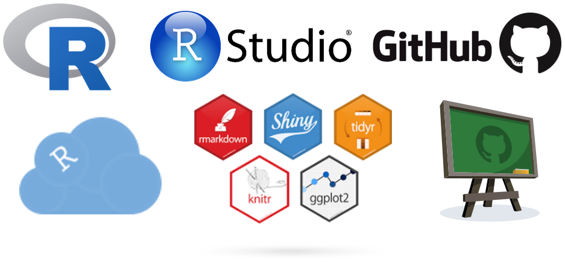
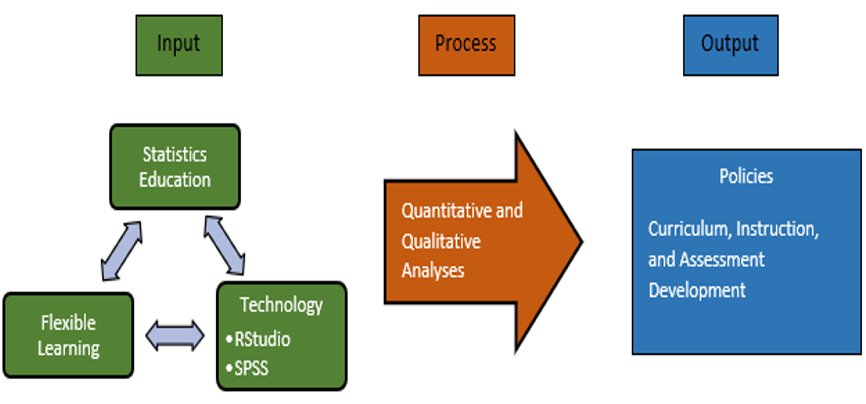

# Introduction

## Rationale

In the GAISE report, one noteworthy recommendation is "the use of technology to explore concepts and analyze data" [@GCR16, p. 3].

According to @mcnamara15, there is a need to bridge the gap between tools for learning and doing statistics.

The Commission on Higher Education implemented flexible learning to cope up with the changes brought about by the pandemic [@CMO_04_20].

# Introduction

## Rationale

# Introduction

## Rationale

### Advantages of Using R [@dataflair_2019]

1. Open Source

2. Exemplary Support for Data Wrangling

3. The Array of Packages

4. Quality Plotting and Graphing

5. Highly Compatible

6. Platform Independent

# Introduction

## Rationale

### Advantages of Using R [@dataflair_2019]

7. Eye-Catching Reports

8. Machine Learning Operations

9. Statistics

10. Continuously Growing

# Introduction

## Statement of Objectives

RStudio as a statistical computing tool in learning data management will be introduced to BSEd Mathematics and BS Mathematics students of NVSU. The objectives of the researcher after gathering profile variables, employing a two group counterbalanced measures design, and letting the students share their stories and narratives in using and not using RStudio in their data management class through essay are:

1. To determine the performance of the students before and after using and not using RStudio in their data management class.

2. To determine the effect of using RStudio in the performance of students in their data management class.

3. To describe the experiences of the participants in using and not using RStudio in their data management class.

4. To identify departure points as basis for policies that will lead to curriculum, instruction and assessment development with respect to statistics education in NVSU specially with flexible learning.

# Introduction

## Research Paradigm

# Introduction

## Significance of the Study

1. University Administrators

2. Faculty members teaching statistics

3. Students

4. Future Researchers

# Research Methodology

## Research Design

The research design will be quasi experimental design. It will employ two group counterbalanced design or 2x2 latin square design. Mixed-method will be used. It will be a combination of quantitative and qualitative methods. 

# Research Methodology

## Research Environment

The research will be conducted in Nueva Vizcaya State University (NVSU) at Bayombong, Nueva Vizcaya.

# Research Methodology

## Subject of the Study

The respondents of the study are first year BSEd Mathematics students and BS Mathematics students of NVSU taking data management class in their Mathematics in the Modern World subject during the first semester of the school year 2020-2021.

# Research Methodology

## Research Instruments

1. Consent form

2. Questionnaire with essay question

3. Pre-test and post-tests

4. Letter to the President of NVSU

5. Syllabus in Mathematics in the Modern World

6. RStudio, RStudio.cloud, GitHub

# Research Methodology

## Data Gathering Procedure

Before conducting the experiment, the researcher will write a letter to the President of NVSU to ask permission. The researcher will then let the students sign the consent form. Statistical tests will be performed to the pre-test and post-test for validity and reliability before conducting the tests. Then the pre-test and post-test will be conducted. Post-tests will be conducted after each topic. Narratives and experiences on using and not using RStudio will be gathered through an essay question to be answered by the respondents. The essay question will also come with the survey questionnaire for the profile variables. The data gathered will then be analyzed and interpreted.

# Research Methodology

## Treatment of Data

Both descriptive and inferential statistics will be used in analyzing the data. Descriptive statistics will be computed for the profile variables. For the difference in the mean scores of the students when grouped according to using and not using RStudio, according to course, and according to topic, the test procedure will be F-test, and the test statistics will be $F_c=\frac{MSC}{MSE}\sim F_{[t-1,(t-1)(t-2)]}$ and the decision rule will be to reject $H_0$ if $F_c>F_{\alpha[t-1,(t-1)(t-2)]}$, otherwise fail to reject $H_0$.

From the narratives and experiences of the students the researcher will come up with categories and themes that will serve as departure points to craft policies that will lead to curriculum, instruction and assessment development with respect to statistics education in NVSU specially with flexible learning.

# References